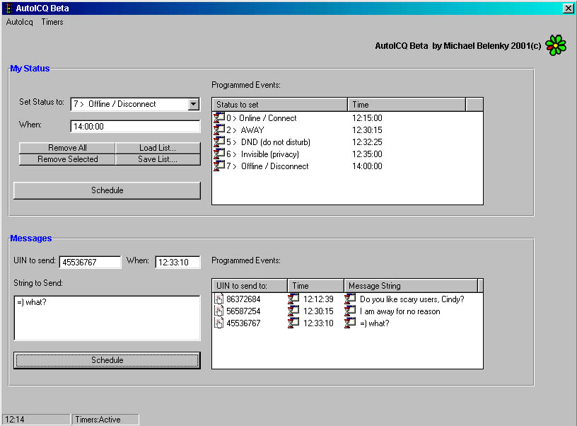



## AutoICQ \- Automate ICQ

### Description

This app uses ICQ API calls

schedule functions to be done by ICQ in the future, without supervision.

the current Beta version allowes you to schedule your UIN status change (online, away, offline , dnd, free for chat...) and also allows you to schedule the sending of messages

to other ICQ users, by your ICQ client. future versions will include the possibility to schedule file sending as well.

this is a good example of how to use some of the ICQ API calls

I understand the ICQ API DLL file ICQMAPI.DLL maybe removed during the submit process, if it is

you can probably find it in your ICQ folder or

at web.icq.com/api
 
### More Info
 
put ICQMAPI.DLL in your system folder

(it's supplied here)

make sure ICQ is running!(not the ICQ launch agent)

             |
---                |---
**Submitted On**   |2001-07-10 12:12:26
**By**             |[Michael Bel\.](https://github.com/Planet-Source-Code/PSCIndex/blob/master/ByAuthor/michael-bel.md)
**Level**          |Advanced
**User Rating**    |4.8 (19 globes from 4 users)
**Compatibility**  |VB 5\.0, VB 6\.0
**Category**       |[Complete Applications](https://github.com/Planet-Source-Code/PSCIndex/blob/master/ByCategory/complete-applications__1-27.md)
**World**          |[Visual Basic](https://github.com/Planet-Source-Code/PSCIndex/blob/master/ByWorld/visual-basic.md)
**Archive File**   |[AutoICQ \- 226087122001\.zip](https://github.com/Planet-Source-Code/michael-bel-autoicq-automate-icq__1-24936/archive/master.zip)

